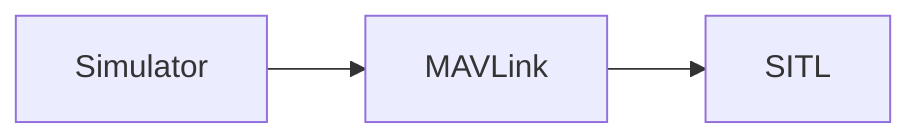

# Software in the Loop (SITL) Simulation

Software in the Loop Simulation runs the complete system on the host machine and simulates the autopilot. It connects via local network to the simulator. The setup looks like this:



## Running SITL

After ensuring that the [simulation prerequisites](simulation-prerequisites.md) are installed on the system, just launch: The convenience make target will compile the POSIX host build and run the simulation.

<div class="host-code"></div>

```sh
make run_sitl_quad
```

This will bring up the PX4 shell:

```sh
[init] shell id: 140735313310464
[init] task name: mainapp

______  __   __    ___ 
| ___ \ \ \ / /   /   |
| |_/ /  \ V /   / /| |
|  __/   /   \  / /_| |
| |     / /^\ \ \___  |
\_|     \/   \/     |_/

Ready to fly.


pxh>
```

And a window with the 3D view of the [jMAVSim](http://github.com/PX4/jMAVSim.git) simulator:


