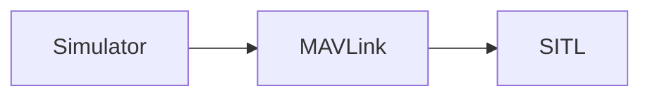

# Software in the Loop (SITL) Simulation

Software in the Loop Simulation runs the complete system on the host machine and simulates the autopilot. It connects via local network to the simulator. The setup looks like this:



## Installation

After ensuring that the [simulation prerequisites](simulation-prerequisites.md) are installed on the system, clone the jMAVSim repository and build and run the simulator in network mode:

<div class="host-code"></div>

```sh
ant
java -Djava.ext.dirs= -cp lib/*:out/production/jmavsim.jar me.drton.jmavsim.Simulator -udp 127.0.0.1:14560

```

## Building and Running SITL

The convenience make target will compile the POSIX host build and run the simulation.

<div class="host-code"></div>

```sh
make run_sitl_quad
```
